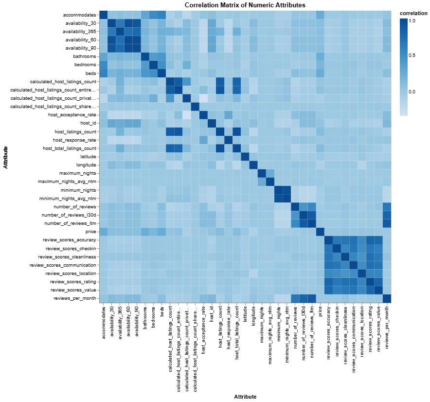
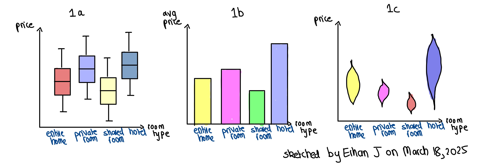
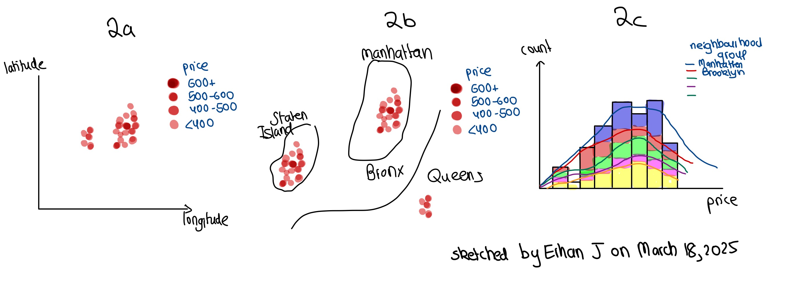
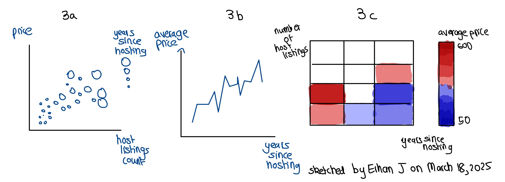
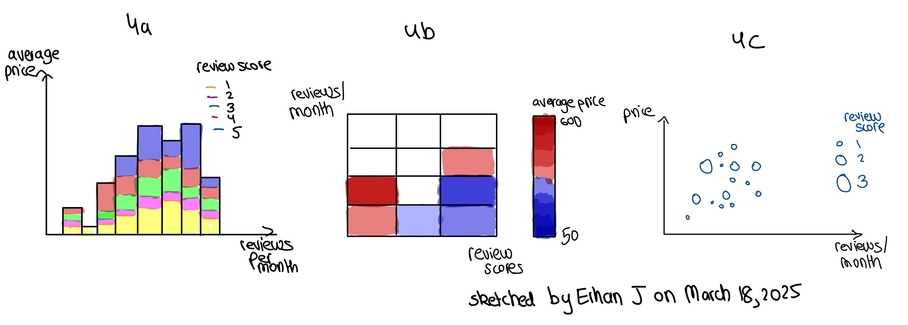
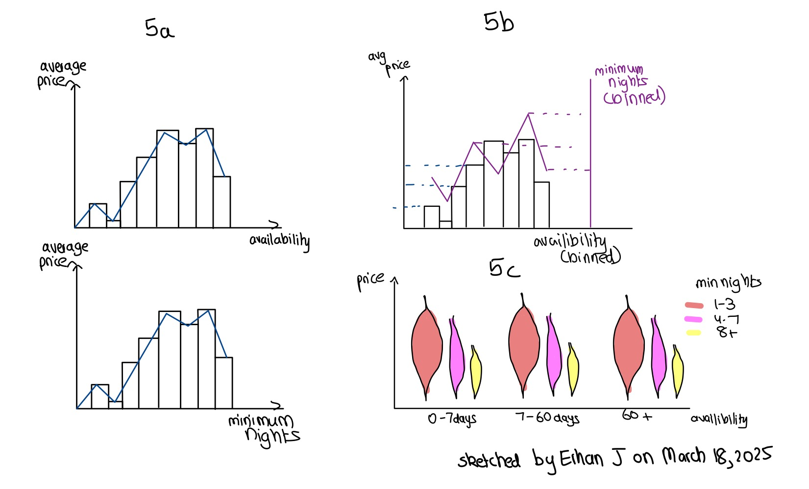

# Group AECA - Airbnb in NYC: Market Trends & Impact

## 1. Introduction 

### 1.1 Dataset Description
The Inside Airbnb dataset is a comprehensive collection of Airbnb listings in many major cities around the world. For our project, we will focus on the New York City dataset, which includes 377,784 records with each row representing an individual listing. The dataset features 75 columns that cover essential details like listing name, host identity verification, neighbourhood, room type, price per night, and availability. It also includes review metrics like the number of reviews, last review date, and ratings to provide insights into customer experiences. This dataset is useful for analyzing Airbnb market dynamics, host behaviours, pricing strategies, and customer preferences in New York City. 

### 1.2 Data Source
The dataset is publicly available on [Inside Airbnb](https://insideairbnb.com/get-the-data/) under a Creative Commons Attribution 4.0 International License. The data is scraped from publicly available information on the Airbnb site. Afterwards, it is analyzed, cleansed, and aggregated by the collaborators of the project. The dataset is updated quarterly and includes information for the last twelve months. The version that we are using for our project was last updated on March 1, 2025. 


### 1.3 Team Members 

**Carol Zhang**: I am a fifth-year Commerce student with a minor in Data Science. I am interested in this dataset because Airbnb is a major player in the travel industry. Through my travels on exchange, I came to realize how important guest satisfaction is and how other reviews heavily influenced my decision-making when choosing accommodation. I want to better understand the factors that lead to positive guest experiences and make wiser choices the next time I travel.
  
**Ayuho Negishi**: I am a fifth-year Psychology student minoring in Data Science. My academic background has made me very interested in understanding human behaviour. I am especially curious how host strategies on Airbnb, like being a verified host, having multiple listings, or offering instant booking, influence guest satisfaction, booking frequency, and pricing. I want to find patterns in how these host behaviours affect the success of listings and the overall competitiveness in the Airbnb market.

**Erhan Asad Javed**: I'm a fourth-year Mathematics student with a minor in Data Science. This dataset is particularly interesting to me because it allows me to apply my practical skills in data cleaning, organization, and visualization to explore patterns in short-term rentals and urban housing dynamics. My goal is to uncover underlying trends in Airbnb pricing, host behaviour, guest satisfaction, and location-based factors affecting listings in New York City. Through this analysis, I aim to provide insights that can help travellers make informed decisions, hosts optimize their strategies, and policymakers better understand Airbnb’s impact on the housing market.

**Aaron Ma**: I’m a 3rd year Computer Science student. This dataset is particularly interesting to me because of the prevalence of AirBnB in a very common activity, travel. As someone who heavily relies on public reviews, I would like to see how hosts can leverage their tools such as being verified and having high response time, to gain an advantage against others in such a competitive space. I would like to better understand how Airbnb hosts garner advantages over one another through means that are not as obvious such as price. 

### 1.4 Intended Audience 
The intended audience for this project is Airbnb hosts and short-term rental operators. By analyzing location, pricing strategies, host behaviour, and guest satisfaction factors, this project aims to provide hosts with valuable insights into how they can optimize their listings for better performance. Hosts will learn how elements such as neighbourhood, room type, cancellation policies, and review ratings influence pricing and booking frequency. This information will help them refine their strategies, improve guest experiences, and increase bookings to stay competitive in a dynamic market.


## 2. About the Data 

### 2.1 Data Abstraction 

| Attribute Name                     | Attribute Type             | Data Semantics                                                 | Cardinality                                   |
|-------------------------------------|----------------------------|---------------------------------------------------------------|----------------------------------------------|
| id                                  | Nominal                    | Unique identifier for each listing                            | 37784                                        |
| listing_url                         | Nominal                    | URL for listing on Airbnb                                     | 37784                                        |
| scrape_id                           | Nominal                    | Unique identifier for data collection/scrape session          | 1                                            |
| last_scraped                        | Temporal                   | Date of last data collection/scrape session                   | 1 [2025-03-01]                               |
| source                              | Nominal                    | Where the data was sourced from                                | 2                                            |
| name                                | Nominal                    | Name of the listing                                           | 36057                                        |
| description                         | Nominal                    | Description of the listing                                    | 31144                                        |
| neighborhood_overview               | Nominal                    | Description of the neighbourhood                              | 15119                                        |
| picture_url                         | Nominal                    | URL link to pictures of the property                           | 36983                                        |
| host id                             | Nominal                    | Unique identifier for each host                               | 22323                                        |
| host_url                            | Nominal                    | URL link to the host’s profile                                | 22323                                        |
| host_name                           | Nominal                    | Name of the host                                              | 8495                                         |
| host_since                          | Temporal                   | Date when the host started listing on Airbnb                   | 5095 [2008-08-11, 2024-12-27]                |
| host_location                       | Nominal                    | Location of the host                                          | 987                                          |
| host_about                          | Nominal                    | Host bios                                                      | 11679                                        |
| host_response_time                  | Ordinal                    | Time taken by the host to respond                             | 4                                            |
| host_response_rate                  | Quantitative (Continuous)  | The response rate of the host                                  | 59 [0.0, 1.0]                                |
| host_acceptance_rate                | Quantitative (Continuous)  | Acceptance rate of booking requests by the host                | 100 [0.0, 1.0]                               |
| host_is_superhost                   | Binary (Boolean)           | Whether the host is a Superhost                               | 2                                            |
| host_neighbourhood                  | Nominal                    | Neighbourhood of the host's primary location                   | 521                                          |
| host_thumbnail_url                  | Nominal                    | URL link to the host’s thumbnail                               | 21723                                        |
| host_picture_url                    | Nominal                    | URL link to the host’s profile picture                         | 21723                                        |
| host_listings_count                 | Quantitative (Discrete)    | Number of listings the host has on Airbnb                      | 121 [1.0, 5079.0]                            |
| host_total_listings_count           | Quantitative (Discrete)    | Total number of listings the host has (including other platforms) | 145 [1.0, 9048.0]                            |
| host_verifications                  | Nominal                    | Types of verification that the host has gone through          | 7                                            |
| host_has_profile_pic                | Binary (Boolean)           | Whether the host has a profile pic                             | 2                                            |
| host_identity_verified              | Binary (Boolean)           | Whether the host's identity is verified                        | 2                                            |
| neighbourhood                        | Nominal                    | Unclear, no semantic meaning                                   | 1                                            |
| neighbourhood_cleansed              | Nominal                    | Cleaned version of the specific neighbourhood location         | 223                                          |
| neighbourhood_group_cleansed        | Nominal                    | Cleaned version of the neighbourhood group/area               | 5                                            |
| latitude                            | Quantitative (Continuous)  | Latitude of the listing                                        | 23085 [40.5003663, 40.91139]                 |
| longitude                           | Quantitative (Continuous)  | Longitude of the listing                                       | 20843 [-74.251907, -73.71365]                |
| property_type                       | Nominal                    | Type of the property                                          | 69                                           |
| room_type                           | Nominal                    | Type of the room                                              | 4                                            |
| accommodates                        | Quantitative (Discrete)    | Number of people that the listing can accommodate              | 16 [1, 16]                                   |
| bathrooms                           | Quantitative (Discrete)    | Number of bathrooms in the listing                             | 17 [0, 15.5]                                 |
| bathrooms_text                      | Nominal                    | Description of the bathroom type e.g. shared or private bathroom | 31                                           |
| bedrooms                            | Quantitative (Discrete)    | Number of bedrooms in the listing                              | 14 [0, 16]                                   |
| beds                                | Quantitative (Discrete)    | Number of beds in the listing                                  | 19 [0, 42]                                   |
| amenities                           | Nominal                    | List of amenities offered by the listing                       | 30453                                        |
| price                               | Quantitative (Continuous)  | Price per night for the listing                                | 897 [8.0, 20000.0]                           |
| minimum_nights                      | Quantitative (Discrete)    | Minimum number of nights required to book                     | 121 [1, 1250]                                |
| maximum_nights                      | Quantitative (Discrete)    | Maximum number of nights available for booking                | 255 [1, 2147483647]                          |
| minimum_minimum_nights              | Quantitative (Discrete)    | Minimum value for minimum nights                               | 118 [1.0, 1250]                              |
| maximum_minimum_nights              | Quantitative (Discrete)    | Maximum value for minimum nights                               | 140 [1.0, 1250.0]                            |
| minimum_maximum_nights              | Quantitative (Discrete)    | Minimum value for maximum nights                               | 241 [1.0, 2147483647.0]                      |
| maximum_maximum_nights              | Quantitative (Discrete)    | Maximum value for maximum nights                               | 240 [1.0, 2147483647.0]                      |
| minimum_nights_avg_ntm              | Quantitative (Continuous)  | Average minimum number of nights required per month           | 429 [1.0, 1250.0]                            |
| maximum_nights_avg_ntm              | Quantitative (Continuous)  | Average maximum number of nights available per month          | 989 [1.0, 2147483647.0]                      |
| calendar_updated                    | Nominal                    | Unclear, no semantic meaning                                   | 0                                            |
| has_availability                    | Binary (Boolean)           | Whether the listing has availability                          | 2                                            |
| availability_30                     | Quantitative (Discrete)    | Availability over the next 30 days                             | 31 [0, 30]                                   |
| availability_60                     | Quantitative (Discrete)    | Availability over the next 60 days                             | 61 [0, 60]                                   |
| availability_90                     | Quantitative (Discrete)    | Availability over the next 90 days                             | 91 [0, 90]                                   |
| availability_365                    | Quantitative (Discrete)    | Availability over the next 365 days                            | 366 [0, 365]                                 |
| calendar_last_scraped               | Temporal                   | Date when the availability information was last scraped from the calendar | 1 [2025-03-01]                               |
| number_of_reviews                   | Quantitative (Discrete)    | Number of reviews for the listing                              | 492 [0, 2485]                                |
| number_of_reviews_ltm               | Quantitative (Discrete)    | Number of reviews in the last twelve months                   | 175 [0, 1779]                                |
| number_of_reviews_l30d              | Quantitative (Discrete)    | Number of reviews in the last 30 days                          | 34 [0, 137]                                  |
| first_review                         | Temporal                   | Date of the first review for the listing                       | 4284 [2009-05-25, 2025-01-02]                |
| last_review                          | Temporal                   | Date of the most recent review                                | 3204 [2011-05-12, 2025-01-02]               |
| review_scores_rating                | Quantitative (Continuous)  | Average rating score from reviews                              | 163 [0.0, 5.0]                               |
| review_scores_accuracy              | Quantitative (Continuous)  | Accuracy rating from reviews                                   | 152 [0.0, 5.0]                               |
| review_scores_cleanliness           | Quantitative (Continuous)  | Cleanliness rating from reviews                                | 180 [0.0, 5.0]                               |
| review_scores_checkin               | Quantitative (Continuous)  | Check-in process rating from reviews                           | 133 [0.0, 5.0]                               |
| review_scores_communication         | Quantitative (Continuous)  | Communication rating from reviews                              | 144 [0.0, 5.0]                               |
| review_scores_location              | Quantitative (Continuous)  | Location rating from reviews                                   | 149 [0.0, 5.0]                               |
| review_scores_value                 | Quantitative (Continuous)  | Value for money rating from reviews                            | 166 [0.0, 5.0]                               |
| license                             | Nominal                    | Property license if available                                  | 1970                                         |
| instant_bookable                    | Binary (boolean)           | Whether the listing can be booked instantly                   | 2                                            |
| calculated_host_listings_count      | Quantitative (Discrete)    | Number of listings listed by the host                          | 73 [1.0, 1154.0]                             |
| calculated_host_listings_count_entire_homes | Quantitative (Discrete) | Number of entire home listings by the host                     | 53 [0.0, 1154.0]                             |
| calculated_host_listings_count_private_rooms | Quantitative (Discrete) | Number of private room listings hosted by the host             | 42 [0.0, 739.0]                              |
| calculated_host_listings_count_shared_rooms | Quantitative (Discrete) | Number of shared room listings hosted by the host              | 5 [0.0, 4.0]                                 |
| reviews_per_month                   | Quantitative (Discrete)    | Average number of reviews per month for the listing            | 801 [0.01, 116.3]                            |


### 2.2 Exploratory Data Analysis

#### General 
**Dataset Cleaning Workflow:**
1. Drop unncessary columns
2. Fill NA values with desired fill values
3. Convert datetime columns to pandas datetime format
4. Convert percentage columns to [0,1] scale
5. Clean price column to remove special characters and symbols
6. Impute missing numerical values with median
7. Impute missing categorical values with the mode
8. Convert binary valued columns to boolean

The cleaning workflows can be seen in directory: `code/cleaning_workflows.py`


```python
df_cleaned.head()
```


<div>
<style scoped>
    .dataframe tbody tr th:only-of-type {
        vertical-align: middle;
    }

    .dataframe tbody tr th {
        vertical-align: top;
    }

    .dataframe thead th {
        text-align: right;
    }
</style>
<table border="1" class="dataframe">
  <thead>
    <tr style="text-align: right;">
      <th></th>
      <th>name</th>
      <th>description</th>
      <th>neighborhood_overview</th>
      <th>host_id</th>
      <th>host_since</th>
      <th>host_location</th>
      <th>host_about</th>
      <th>host_response_time</th>
      <th>host_response_rate</th>
      <th>host_acceptance_rate</th>
      <th>...</th>
      <th>review_scores_checkin</th>
      <th>review_scores_communication</th>
      <th>review_scores_location</th>
      <th>review_scores_value</th>
      <th>instant_bookable</th>
      <th>calculated_host_listings_count</th>
      <th>calculated_host_listings_count_entire_homes</th>
      <th>calculated_host_listings_count_private_rooms</th>
      <th>calculated_host_listings_count_shared_rooms</th>
      <th>reviews_per_month</th>
    </tr>
  </thead>
  <tbody>
    <tr>
      <th>0</th>
      <td>1 br in a 2 br apt (Midtown West)</td>
      <td>No description available</td>
      <td>No overview available</td>
      <td>169927</td>
      <td>2010-07-17</td>
      <td>Saint-Aubin-sur-Scie, France</td>
      <td>Facebook Likes:\r\nNew York French Geek, David...</td>
      <td>within a day</td>
      <td>1.00</td>
      <td>0.88</td>
      <td>...</td>
      <td>4.98</td>
      <td>5.00</td>
      <td>4.98</td>
      <td>4.86</td>
      <td>False</td>
      <td>2</td>
      <td>1</td>
      <td>1</td>
      <td>0</td>
      <td>0.25</td>
    </tr>
    <tr>
      <th>1</th>
      <td>A lovely room w/ a Manhattan view</td>
      <td>A private, furnished  large room to rent Jan/F...</td>
      <td>Nate Silver called this super safe, clean, qui...</td>
      <td>110506</td>
      <td>2010-04-18</td>
      <td>New York, NY</td>
      <td>I grew up in South Korea, moved to Montreal, C...</td>
      <td>within a few hours</td>
      <td>1.00</td>
      <td>0.60</td>
      <td>...</td>
      <td>4.96</td>
      <td>4.96</td>
      <td>4.79</td>
      <td>4.93</td>
      <td>False</td>
      <td>1</td>
      <td>0</td>
      <td>1</td>
      <td>0</td>
      <td>0.20</td>
    </tr>
    <tr>
      <th>2</th>
      <td>Private, Large &amp; Sunny 1BR w/W&amp;D</td>
      <td>It's a No Brainer:&lt;br /&gt;•Terrific Space For Le...</td>
      <td>The Neighborhood&lt;br /&gt;• Rich History &lt;br /&gt;• B...</td>
      <td>170510</td>
      <td>2010-07-18</td>
      <td>New York, United States</td>
      <td>I am a self employed licensed real estate brok...</td>
      <td>No response time</td>
      <td>1.00</td>
      <td>0.88</td>
      <td>...</td>
      <td>4.89</td>
      <td>4.92</td>
      <td>4.38</td>
      <td>4.72</td>
      <td>False</td>
      <td>2</td>
      <td>2</td>
      <td>0</td>
      <td>0</td>
      <td>1.93</td>
    </tr>
    <tr>
      <th>3</th>
      <td>Beautiful Lower East Side Loft</td>
      <td>Architect-owned loft is a corner unit in a bea...</td>
      <td>The apartment is in the border of Soho, LES an...</td>
      <td>184755</td>
      <td>2010-07-29</td>
      <td>New York, NY</td>
      <td>I am an architect living in NYC and have my ow...</td>
      <td>within a day</td>
      <td>1.00</td>
      <td>1.00</td>
      <td>...</td>
      <td>4.85</td>
      <td>4.87</td>
      <td>4.57</td>
      <td>4.62</td>
      <td>False</td>
      <td>1</td>
      <td>1</td>
      <td>0</td>
      <td>0</td>
      <td>0.40</td>
    </tr>
    <tr>
      <th>4</th>
      <td>@HouseOnHenrySt - Private 2nd bedroom w/shared...</td>
      <td>No description available</td>
      <td>Lovely old Brooklyn neighborhood, with brick/b...</td>
      <td>11481</td>
      <td>2009-03-26</td>
      <td>New York, NY</td>
      <td>I have been a host with Airbnb since its intro...</td>
      <td>within a day</td>
      <td>0.67</td>
      <td>0.33</td>
      <td>...</td>
      <td>4.71</td>
      <td>4.73</td>
      <td>4.58</td>
      <td>4.64</td>
      <td>False</td>
      <td>4</td>
      <td>1</td>
      <td>3</td>
      <td>0</td>
      <td>1.26</td>
    </tr>
  </tbody>
</table>
<p>5 rows × 57 columns</p>
</div>


```python
df_cleaned.shape
```


    (37784, 57)


```python
df_cleaned.info()
```

    <class 'pandas.core.frame.DataFrame'>
    RangeIndex: 37784 entries, 0 to 37783
    Data columns (total 57 columns):
     #   Column                                        Non-Null Count  Dtype         
    ---  ------                                        --------------  -----         
     0   name                                          37784 non-null  object        
     1   description                                   37784 non-null  object        
     2   neighborhood_overview                         37784 non-null  object        
     3   host_id                                       37784 non-null  int64         
     4   host_since                                    37784 non-null  datetime64[ns]
     5   host_location                                 37784 non-null  object        
     6   host_about                                    37784 non-null  object        
     7   host_response_time                            37784 non-null  object        
     8   host_response_rate                            37784 non-null  float64       
     9   host_acceptance_rate                          37784 non-null  float64       
     10  host_is_superhost                             37784 non-null  bool          
     11  host_neighbourhood                            37784 non-null  object        
     12  host_listings_count                           37784 non-null  float64       
     13  host_total_listings_count                     37784 non-null  float64       
     14  host_verifications                            37784 non-null  object        
     15  host_has_profile_pic                          37784 non-null  bool          
     16  host_identity_verified                        37784 non-null  bool          
     17  neighbourhood_cleansed                        37784 non-null  object        
     18  neighbourhood_group_cleansed                  37784 non-null  object        
     19  latitude                                      37784 non-null  float64       
     20  longitude                                     37784 non-null  float64       
     21  property_type                                 37784 non-null  object        
     22  room_type                                     37784 non-null  object        
     23  accommodates                                  37784 non-null  int64         
     24  bathrooms                                     37784 non-null  float64       
     25  bedrooms                                      37784 non-null  float64       
     26  beds                                          37784 non-null  float64       
     27  amenities                                     37784 non-null  object        
     28  price                                         37784 non-null  float64       
     29  minimum_nights                                37784 non-null  int64         
     30  maximum_nights                                37784 non-null  int64         
     31  minimum_nights_avg_ntm                        37784 non-null  float64       
     32  maximum_nights_avg_ntm                        37784 non-null  float64       
     33  has_availability                              37784 non-null  bool          
     34  availability_30                               37784 non-null  int64         
     35  availability_60                               37784 non-null  int64         
     36  availability_90                               37784 non-null  int64         
     37  availability_365                              37784 non-null  int64         
     38  calendar_last_scraped                         37784 non-null  datetime64[ns]
     39  number_of_reviews                             37784 non-null  int64         
     40  number_of_reviews_ltm                         37784 non-null  int64         
     41  number_of_reviews_l30d                        37784 non-null  int64         
     42  first_review                                  37784 non-null  datetime64[ns]
     43  last_review                                   37784 non-null  datetime64[ns]
     44  review_scores_rating                          37784 non-null  float64       
     45  review_scores_accuracy                        37784 non-null  float64       
     46  review_scores_cleanliness                     37784 non-null  float64       
     47  review_scores_checkin                         37784 non-null  float64       
     48  review_scores_communication                   37784 non-null  float64       
     49  review_scores_location                        37784 non-null  float64       
     50  review_scores_value                           37784 non-null  float64       
     51  instant_bookable                              37784 non-null  bool          
     52  calculated_host_listings_count                37784 non-null  int64         
     53  calculated_host_listings_count_entire_homes   37784 non-null  int64         
     54  calculated_host_listings_count_private_rooms  37784 non-null  int64         
     55  calculated_host_listings_count_shared_rooms   37784 non-null  int64         
     56  reviews_per_month                             37784 non-null  float64       
    dtypes: bool(5), datetime64[ns](4), float64(20), int64(15), object(13)
    memory usage: 15.2+ MB
    


```python
df_numerical.describe()
```


<div>
<style scoped>
    .dataframe tbody tr th:only-of-type {
        vertical-align: middle;
    }

    .dataframe tbody tr th {
        vertical-align: top;
    }

    .dataframe thead th {
        text-align: right;
    }
</style>
<table border="1" class="dataframe">
  <thead>
    <tr style="text-align: right;">
      <th></th>
      <th>host_since</th>
      <th>host_response_rate</th>
      <th>host_acceptance_rate</th>
      <th>host_listings_count</th>
      <th>host_total_listings_count</th>
      <th>accommodates</th>
      <th>bathrooms</th>
      <th>bedrooms</th>
      <th>beds</th>
      <th>price</th>
      <th>minimum_nights</th>
      <th>maximum_nights</th>
      <th>minimum_nights_avg_ntm</th>
      <th>maximum_nights_avg_ntm</th>
      <th>availability_30</th>
      <th>availability_60</th>
      <th>availability_90</th>
      <th>availability_365</th>
      <th>calendar_last_scraped</th>
      <th>number_of_reviews</th>
      <th>number_of_reviews_ltm</th>
      <th>number_of_reviews_l30d</th>
      <th>first_review</th>
      <th>last_review</th>
      <th>review_scores_rating</th>
      <th>review_scores_accuracy</th>
      <th>review_scores_cleanliness</th>
      <th>review_scores_checkin</th>
      <th>review_scores_communication</th>
      <th>review_scores_location</th>
      <th>review_scores_value</th>
      <th>calculated_host_listings_count</th>
      <th>calculated_host_listings_count_entire_homes</th>
      <th>calculated_host_listings_count_private_rooms</th>
      <th>calculated_host_listings_count_shared_rooms</th>
      <th>reviews_per_month</th>
    </tr>
  </thead>
  <tbody>
    <tr>
      <th>count</th>
      <td>37784</td>
      <td>37784.000000</td>
      <td>37784.000000</td>
      <td>37784.000000</td>
      <td>37784.000000</td>
      <td>37784.000000</td>
      <td>37784.000000</td>
      <td>37784.000000</td>
      <td>37784.000000</td>
      <td>37784.000000</td>
      <td>37784.000000</td>
      <td>3.778400e+04</td>
      <td>37784.000000</td>
      <td>3.778400e+04</td>
      <td>37784.000000</td>
      <td>37784.000000</td>
      <td>37784.000000</td>
      <td>37784.000000</td>
      <td>37784</td>
      <td>37784.000000</td>
      <td>37784.000000</td>
      <td>37784.000000</td>
      <td>37784</td>
      <td>37784</td>
      <td>37784.000000</td>
      <td>37784.000000</td>
      <td>37784.000000</td>
      <td>37784.000000</td>
      <td>37784.000000</td>
      <td>37784.000000</td>
      <td>37784.000000</td>
      <td>37784.000000</td>
      <td>37784.000000</td>
      <td>37784.000000</td>
      <td>37784.000000</td>
      <td>37784.000000</td>
    </tr>
    <tr>
      <th>mean</th>
      <td>2017-03-06 09:48:26.373067776</td>
      <td>0.952508</td>
      <td>0.812859</td>
      <td>263.054864</td>
      <td>351.429229</td>
      <td>2.754896</td>
      <td>1.119654</td>
      <td>1.321723</td>
      <td>1.383946</td>
      <td>170.434126</td>
      <td>28.882172</td>
      <td>5.793950e+04</td>
      <td>29.497840</td>
      <td>8.501277e+05</td>
      <td>12.314075</td>
      <td>27.011275</td>
      <td>42.416552</td>
      <td>163.400963</td>
      <td>2025-01-03 00:00:00</td>
      <td>25.658639</td>
      <td>3.731447</td>
      <td>0.294357</td>
      <td>2021-02-19 02:42:05.259369216</td>
      <td>2023-05-11 06:14:56.379419904</td>
      <td>4.763849</td>
      <td>4.805924</td>
      <td>4.704505</td>
      <td>4.870094</td>
      <td>4.867555</td>
      <td>4.775639</td>
      <td>4.676217</td>
      <td>71.636354</td>
      <td>45.435555</td>
      <td>23.985232</td>
      <td>0.005187</td>
      <td>0.685365</td>
    </tr>
    <tr>
      <th>min</th>
      <td>2008-08-11 00:00:00</td>
      <td>0.000000</td>
      <td>0.000000</td>
      <td>1.000000</td>
      <td>1.000000</td>
      <td>1.000000</td>
      <td>0.000000</td>
      <td>0.000000</td>
      <td>0.000000</td>
      <td>8.000000</td>
      <td>1.000000</td>
      <td>1.000000e+00</td>
      <td>1.000000</td>
      <td>1.000000e+00</td>
      <td>0.000000</td>
      <td>0.000000</td>
      <td>0.000000</td>
      <td>0.000000</td>
      <td>2025-01-03 00:00:00</td>
      <td>0.000000</td>
      <td>0.000000</td>
      <td>0.000000</td>
      <td>2009-05-25 00:00:00</td>
      <td>2011-05-12 00:00:00</td>
      <td>0.000000</td>
      <td>0.000000</td>
      <td>0.000000</td>
      <td>0.000000</td>
      <td>0.000000</td>
      <td>0.000000</td>
      <td>0.000000</td>
      <td>1.000000</td>
      <td>0.000000</td>
      <td>0.000000</td>
      <td>0.000000</td>
      <td>0.010000</td>
    </tr>
    <tr>
      <th>25%</th>
      <td>2014-07-07 00:00:00</td>
      <td>1.000000</td>
      <td>0.840000</td>
      <td>1.000000</td>
      <td>1.000000</td>
      <td>2.000000</td>
      <td>1.000000</td>
      <td>1.000000</td>
      <td>1.000000</td>
      <td>113.750000</td>
      <td>30.000000</td>
      <td>1.500000e+02</td>
      <td>30.000000</td>
      <td>3.650000e+02</td>
      <td>0.000000</td>
      <td>0.000000</td>
      <td>0.000000</td>
      <td>0.000000</td>
      <td>2025-01-03 00:00:00</td>
      <td>0.000000</td>
      <td>0.000000</td>
      <td>0.000000</td>
      <td>2019-01-21 00:00:00</td>
      <td>2023-03-19 00:00:00</td>
      <td>4.750000</td>
      <td>4.817500</td>
      <td>4.690000</td>
      <td>4.890000</td>
      <td>4.900000</td>
      <td>4.750000</td>
      <td>4.670000</td>
      <td>1.000000</td>
      <td>0.000000</td>
      <td>0.000000</td>
      <td>0.000000</td>
      <td>0.160000</td>
    </tr>
    <tr>
      <th>50%</th>
      <td>2016-08-02 00:00:00</td>
      <td>1.000000</td>
      <td>0.880000</td>
      <td>2.000000</td>
      <td>3.000000</td>
      <td>2.000000</td>
      <td>1.000000</td>
      <td>1.000000</td>
      <td>1.000000</td>
      <td>132.000000</td>
      <td>30.000000</td>
      <td>3.650000e+02</td>
      <td>30.000000</td>
      <td>5.676500e+02</td>
      <td>2.000000</td>
      <td>23.000000</td>
      <td>41.000000</td>
      <td>155.000000</td>
      <td>2025-01-03 00:00:00</td>
      <td>3.000000</td>
      <td>0.000000</td>
      <td>0.000000</td>
      <td>2022-12-11 00:00:00</td>
      <td>2024-10-11 00:00:00</td>
      <td>4.850000</td>
      <td>4.900000</td>
      <td>4.810000</td>
      <td>4.950000</td>
      <td>4.960000</td>
      <td>4.850000</td>
      <td>4.760000</td>
      <td>2.000000</td>
      <td>1.000000</td>
      <td>1.000000</td>
      <td>0.000000</td>
      <td>0.290000</td>
    </tr>
    <tr>
      <th>75%</th>
      <td>2019-10-29 00:00:00</td>
      <td>1.000000</td>
      <td>0.950000</td>
      <td>10.000000</td>
      <td>15.000000</td>
      <td>4.000000</td>
      <td>1.000000</td>
      <td>1.000000</td>
      <td>1.000000</td>
      <td>156.000000</td>
      <td>30.000000</td>
      <td>1.125000e+03</td>
      <td>30.000000</td>
      <td>1.125000e+03</td>
      <td>29.000000</td>
      <td>58.000000</td>
      <td>88.000000</td>
      <td>329.000000</td>
      <td>2025-01-03 00:00:00</td>
      <td>22.000000</td>
      <td>1.000000</td>
      <td>0.000000</td>
      <td>2023-01-01 00:00:00</td>
      <td>2024-12-15 00:00:00</td>
      <td>4.940000</td>
      <td>4.970000</td>
      <td>4.910000</td>
      <td>5.000000</td>
      <td>5.000000</td>
      <td>4.950000</td>
      <td>4.850000</td>
      <td>9.000000</td>
      <td>2.000000</td>
      <td>2.000000</td>
      <td>0.000000</td>
      <td>0.550000</td>
    </tr>
    <tr>
      <th>max</th>
      <td>2024-12-27 00:00:00</td>
      <td>1.000000</td>
      <td>1.000000</td>
      <td>5079.000000</td>
      <td>9048.000000</td>
      <td>16.000000</td>
      <td>15.500000</td>
      <td>16.000000</td>
      <td>42.000000</td>
      <td>20000.000000</td>
      <td>1250.000000</td>
      <td>2.147484e+09</td>
      <td>1250.000000</td>
      <td>2.147484e+09</td>
      <td>30.000000</td>
      <td>60.000000</td>
      <td>90.000000</td>
      <td>365.000000</td>
      <td>2025-01-03 00:00:00</td>
      <td>2485.000000</td>
      <td>1779.000000</td>
      <td>137.000000</td>
      <td>2025-01-02 00:00:00</td>
      <td>2025-01-02 00:00:00</td>
      <td>5.000000</td>
      <td>5.000000</td>
      <td>5.000000</td>
      <td>5.000000</td>
      <td>5.000000</td>
      <td>5.000000</td>
      <td>5.000000</td>
      <td>1154.000000</td>
      <td>1154.000000</td>
      <td>739.000000</td>
      <td>4.000000</td>
      <td>116.300000</td>
    </tr>
    <tr>
      <th>std</th>
      <td>NaN</td>
      <td>0.173547</td>
      <td>0.232501</td>
      <td>1000.361076</td>
      <td>1196.815995</td>
      <td>1.903900</td>
      <td>0.442243</td>
      <td>0.869987</td>
      <td>0.984719</td>
      <td>277.145183</td>
      <td>29.905150</td>
      <td>1.104828e+07</td>
      <td>30.858242</td>
      <td>4.252198e+07</td>
      <td>13.408262</td>
      <td>26.656382</td>
      <td>39.790892</td>
      <td>148.521232</td>
      <td>NaN</td>
      <td>62.619846</td>
      <td>18.798642</td>
      <td>1.485928</td>
      <td>NaN</td>
      <td>NaN</td>
      <td>0.376341</td>
      <td>0.371005</td>
      <td>0.423313</td>
      <td>0.317409</td>
      <td>0.345344</td>
      <td>0.331185</td>
      <td>0.413567</td>
      <td>224.585038</td>
      <td>200.899492</td>
      <td>109.136674</td>
      <td>0.086848</td>
      <td>1.584030</td>
    </tr>
  </tbody>
</table>
</div>


```python
df_cleaned.describe(include=['object'])
```


<div>
<style scoped>
    .dataframe tbody tr th:only-of-type {
        vertical-align: middle;
    }

    .dataframe tbody tr th {
        vertical-align: top;
    }

    .dataframe thead th {
        text-align: right;
    }
</style>
<table border="1" class="dataframe">
  <thead>
    <tr style="text-align: right;">
      <th></th>
      <th>name</th>
      <th>description</th>
      <th>neighborhood_overview</th>
      <th>host_location</th>
      <th>host_about</th>
      <th>host_response_time</th>
      <th>host_neighbourhood</th>
      <th>host_verifications</th>
      <th>neighbourhood_cleansed</th>
      <th>neighbourhood_group_cleansed</th>
      <th>property_type</th>
      <th>room_type</th>
      <th>amenities</th>
    </tr>
  </thead>
  <tbody>
    <tr>
      <th>count</th>
      <td>37784</td>
      <td>37784</td>
      <td>37784</td>
      <td>37784</td>
      <td>37784</td>
      <td>37784</td>
      <td>37784</td>
      <td>37784</td>
      <td>37784</td>
      <td>37784</td>
      <td>37784</td>
      <td>37784</td>
      <td>37784</td>
    </tr>
    <tr>
      <th>unique</th>
      <td>36058</td>
      <td>31140</td>
      <td>15117</td>
      <td>988</td>
      <td>11654</td>
      <td>5</td>
      <td>521</td>
      <td>7</td>
      <td>223</td>
      <td>5</td>
      <td>69</td>
      <td>4</td>
      <td>30453</td>
    </tr>
    <tr>
      <th>top</th>
      <td>Water View King Bed Hotel Room</td>
      <td>No description available</td>
      <td>No overview available</td>
      <td>New York, NY</td>
      <td>We’re Blueground, a global proptech company wi...</td>
      <td>No response time</td>
      <td>Bedford-Stuyvesant</td>
      <td>['email', 'phone']</td>
      <td>Bedford-Stuyvesant</td>
      <td>Manhattan</td>
      <td>Entire rental unit</td>
      <td>Entire home/apt</td>
      <td>["Wifi", "TV", "Smoke alarm", "Carbon monoxide...]</td>
    </tr>
    <tr>
      <th>freq</th>
      <td>30</td>
      <td>973</td>
      <td>17177</td>
      <td>22469</td>
      <td>17326</td>
      <td>15585</td>
      <td>9498</td>
      <td>29303</td>
      <td>2678</td>
      <td>16819</td>
      <td>15887</td>
      <td>20160</td>
      <td>237</td>
    </tr>
  </tbody>
</table>
</div>


    

    


#### Erhan 
Detailed EDA can be found in the directory: `analysis/Erhan/analysis.ipynb`. 

#### Carol
Detailed EDA can be found in the directory: `analysis/Carol/analysis2.ipynb`. 

#### Aaron 
Detailed EDA can be found in the directory: `analysis/Aaron/analysis3.ipynb`. 

#### Ayuho 
Detailed EDA can be found in the directory: `analysis/Ayuho/analysis4.ipynb`. 

## 3. Research Questions 

### Erhan: Pricing & Affordability Trends in NYC

1. How does room type impact price variations?
2. What is the effect of location (neighbourhood group, latitude, and longitude) on price differences?
3. Does the host's listing count or years of hosting (host_since) influence listing prices?
4. How do reviews per month, review scores, and the total number of reviews correlate with pricing?
5. What role does availability over 365 days and minimum nights play in pricing strategies?
   
---

### Carol: Guest Experience & Satisfaction

1. How do listing features like the number of amenities or instant booking availability impact guest satisfaction ratings?
2. What is the relationship between different ratings and listing prices across room types?
3. Which amenities are most frequently associated with higher guest ratings?
   
---

### Aaron: Location & Listing Features, Host Decision-Making, and Booking Preferences

1. What role does instant bookability serve as an incentive booster for less popular neighborhoods?
2. Is there a difference in host behaviour by location?
3. Is it easier to be a Superhost in certain locations?

---

### Ayuho: Host Behaviour & Market Competitiveness

1. How does host identity verification influence the success of a listing (in terms of reviews and ratings)?
2. How do host responses (e.g. response time, acceptance rate) differ between superhosts and non-superhosts, and how does this impact listing success?
3. How do hosts with multiple listings strategically set their pricing, and how does this impact guest satisfaction?

## 4. Task Analysis

### Erhan's Analysis

#### 1. How does room type impact price variations?
- **Retrieve Value**: Extract `room_type` and `price`.
- **Characterize Distribution**: Visualize the spread of prices for different room types.
- **Find Extremum**: Identify the most and least expensive room types.
- **Sort**: Rank room types by average price.
- **Visualizations:**
  - Box plot of `room_type` vs. `price`.
  - Bar chart of average price per `room_type`.

#### 2. What is the effect of location (neighbourhood group, latitude, and longitude) on price differences?
- **Retrieve Value**: Extract `neighbourhood_group_cleansed`, `latitude`, `longitude`, and `price`.
- **Characterize Distribution**: Visualize price variations across different locations.
- **Determine Range**: Identify areas with the highest and lowest price variations.
- **Find Anomalies**: Detect outlier neighbourhoods with extreme pricing.
- **Visualizations:**
  - Geographic heatmap of `price` by location.
  - Bar chart of average `price` per `neighbourhood_group_cleansed`.
  - Scatter plot of `latitude` vs. `longitude`, coloured by `price`.

#### 3. Does the host's listing count or years of hosting (host_since) influence listing prices?
- **Retrieve Value**: Extract `host_since`, `host_listings_count`, and `price`.
- **Compute Derived Value**: Calculate host tenure (years since `host_since`).
- **Find Anomalies**: Identify whether long-time hosts charge significantly higher or lower prices.
- **Correlate**: Analyze the relationship between host tenure/listing count and pricing.
- **Visualizations:**
  - Line chart of years of hosting vs. average price.
  - Scatter plot of `host_listings_count` vs. `price`.
  - Bar chart of price variations by `host_listings_count`.

#### 4. How do reviews per month, review scores, and the total number of reviews correlate with pricing?
- **Retrieve Value**: Extract `reviews_per_month`, `review_scores_rating`, `number_of_reviews`, and `price`.
- **Characterize Distribution**: Examine how review frequency and ratings relate to pricing.
- **Find Extremum**: Identify listings with the highest/lowest review scores and their price trends.
- **Correlate**: Analyze the impact of reviews on pricing.
- **Visualizations:**
  - Binned bar chart of `reviews_per_month` vs. average `price`.
  - Scatter plot of `review_scores_rating` vs. `price`.
  - Correlation heatmap of reviews and pricing-related attributes.

#### 5. What role does availability over 365 days and minimum nights play in pricing strategies?
- **Retrieve Value**: Extract `availability_365`, `minimum_nights`, and `price`.
- **Find Extremum**: Identify listings with extreme availability values and their pricing strategies.
- **Filter**: Compare listings with low and high availability.
- **Sort**: Rank availability and minimum night requirements by `price`.
- **Visualizations:**
  - Scatter plot of `availability_365` vs. `price`.
  - Bar chart of `minimum_nights` vs. average `price`.
  - Grouped bar chart of pricing trends for different availability levels.

---

### Carol's Analysis

#### 1. How do listing features like the number of amenities or instant booking availability impact guest satisfaction ratings?
- **Compute Derived Value**: Count/calculate the number of amenities for each listing.
- **Retrieve Value**: Extract `guest_satisfaction_rating`, `number_of_amenities`, `instant_bookable`.
- **Characterize Distribution**: Visualize satisfaction ratings for different listing features.
- **Correlate**: Analyze the relationship between review score ratings and listing features.
- **Sort**: Sort listings based on `number_of_amenities`.

#### 2. What is the relationship between different ratings and listing prices across room types?
- **Retrieve Value**: Extract `price`, review scores, and `room_type`.
- **Sort**: Sort listings by `price` to observe variations across room types.
- **Correlate**: Analyze the correlation between `price` and review scores by `room_type`.
- **Filter**: Analyze the relationship between `price` and ratings within each `room_type`.
- **Characterize Distribution**: Visualize ratings across different `price` ranges and `room_types`.

#### 3. Which amenities are most frequently associated with higher guest ratings?
- **Retrieve Value**: Extract `guest_satisfaction_rating` and `amenities`.
- **Filter**: Select listings with `review_scores_rating` > 4.5.
- **Cluster**: Group listings by `amenities` and analyze ratings.
- **Find Extremum**: Identify the most frequently occurring amenities.
- **Sort**: Rank amenities by occurrence in top-rated listings.
- **Correlate**: Analyze patterns of high ratings linked to certain amenities.

---

### Aaron's Analysis

#### 1. What role does instant bookability serve as an incentive booster for less popular neighborhoods?
- **Retrieve Value**: Extract `neighbourhood_cleansed`, `instant_bookable`, `number_of_reviews`, and `price`.
- **Filter**: Identify less popular neighbourhoods.
- **Label**: Categorize neighbourhoods as popular or less popular.
- **Calculate**: Use `number_of_reviews` to infer average booking rates.
- **Analyze**: Compare booking rates by `instant_bookable` status.
- **Visualize**: Display different groups.

#### 2. Is there a difference in host behaviour by location?
- **Retrieve Value**: Extract `host_identity_verified`, `calculated_host_listings_count`, `neighbourhood_cleansed`, `neighbourhood_group_cleansed`.
- **Group**: By `neighbourhood_group_cleansed`.
- **Aggregate**: Compute averages for `calculated_host_listings_count` and counts for `host_identity_verified`.
- **Analyze**: Compare differences across neighbourhoods.
- **Visualize**: Display neighbourhood-based host behaviours.

#### 3. Is it easier to be a Superhost in certain locations?
- **Retrieve Value**: Extract `host_is_superhost`, `neighbourhood_group_cleansed`, `calculated_host_listings_count`, `host_identity_verified`, `host_has_profile_pic`, `host_response_time`, `host_response_rate`, and `price`.
- **Group**: By `host_is_superhost` and `neighbourhood_group_cleansed`.
- **Aggregate**: Compute averages for key metrics.
- **Analyze**: Compare Superhost vs. non-Superhost behaviour.
- **Visualize**: Display differences.

---

### Ayuho's Analysis

#### 1: How does host identity verification influence the success of a listing (in terms of reviews and ratings)?
1. **Retrieve Value**: Extract `host_identity_verified`, `number_of_reviews`, `review_scores_rating`.
2. **Filter**: Separate verified (`true`) vs. non-verified (`false`) hosts.
3. **Characterize Distribution**: Boxplots and histograms.
4. **Correlate**: Compare averages.
5. **Find Extremum**: Identify anomalies.

#### 2: How do host responses (e.g. response time, acceptance rate) differ between super hosts and non-super hosts, and how does this impact listing success?**
1. **Retrieve Value**: Extract `host_is_superhost`, `host_response_time`, `host_acceptance_rate`, `number_of_reviews`, `review_scores_rating`.
2. **Filter**: Compare Superhosts (`true`) vs. non-Superhosts (`false`).
3. **Sort**: Categorize `host_response_time`.
4. **Characterize Distribution**: Stacked bar chart, boxplot.
5. **Correlate**: Analyze response and acceptance rates.
6. **Find Extremum**: Identify extreme cases.

#### 3: How do hosts with multiple listings strategically set their pricing, and how does this impact guest satisfaction?
1. **Retrieve Value**: Extract `calculated_host_listings_count`, `price`, `review_scores_rating`.
2. **Filter**: Group by listing count.
3. **Compute Derived Value**: Price-to-rating ratio.
4. **Characterize Distribution**: Bar chart and heatmaps.
5. **Correlate**: Analyze pricing influence.
6. **Find Extremum**: Identify extremes.

## 5. Preliminary Sketches
### Erhan

#### Q1) How does room type impact price variations?
<p align="center">
    
</p>

- **1a - Boxplot**: Displays the distribution of prices for each room type, showing quartiles, median, and outliers. However, it may be difficult to interpret for those unfamiliar with box plots.
- **1b - Bar Chart**: Displays the average price for each room type, making it simple and easy to interpret. However, it does not show price variability.
- **1c - Violin Plot**: Provides a detailed distribution while maintaining clarity. Less common, may require additional explanation.
- **High Fidelity Choice**: **1a (Boxplot)** as it effectively captures price distribution.

#### Q2) What is the effect of location on price differences?
<p align="center">
    
</p>

- **2a - Scatterplot**: Shows the distribution of listings according to latitude and longitude, with price encoded as color. Highlights spatial trends but may suffer from clutter.
- **2b - Choropleth Map**: Expands on 2a by encoding neighborhood groups for better contextual understanding.
- **2c - Stacked Histogram**: Describes the distribution of price across different neighborhoods but lacks geographical context.
- **High Fidelity Choice**: **2b (Choropleth Map)** for clear regional price differences.


#### Q3) Does a host’s listing count or years of hosting influence price?
<p align="center">
    
</p>

- **3a - Scatterplot**: Encodes years since hosting in point size. Displays all data points but may become cluttered.
- **3b - Line Chart**: Shows price trends over years of hosting. Highlights temporal trends but may oversimplify relationships.
- **3c - Heatmap**: Combines number of host listings and years of hosting, encoding price in color. Offers clear comparative insights.
- **High Fidelity Choice**: **3c (Heatmap)** to analyze the combined effect of host experience and listing count.


#### Q4) How do reviews per month, review scores, and total number of reviews affect pricing?
<p align="center">
    
</p>

- **4a - Stacked Bar Chart**: Shows the proportion of different review scores and their relation to price.
- **4b - Heatmap**: Captures relationships between multiple review attributes and price.
- **4c - Scatterplot**: Displays individual review-price relationships but may be scattered.
- **High Fidelity Choice**: **4b (Heatmap)** for better multidimensional insights.


#### Q5) What role does listing availability and minimum nights play in pricing?
<p align="center">
    
</p>

- **5a - Faceted Bar Charts**: Show grouped analysis for availability and minimum nights but may be fragmented.
- **5b - Dual Axis Bar and Line Chart**: Displays both trends but may obscure their combined effects.
- **5c - Grouped Violin Plots**: Captures combined effects in detail.
- **High Fidelity Choice**: **5c (Grouped Violin Plots)** to analyze complex interactions.

The visualizations selected for this project adhere to key theoretical principles in data visualization and analytics:

- **Boxplot for Room Type Pricing**: Follows **Tukey’s exploratory data analysis principles**, providing a robust summary of data distribution, including median, quartiles, and outliers.
- **Choropleth Map for Location-based Pricing Differences**: Aligns with **spatial analysis principles**, offering an intuitive way to identify regional price trends while reducing clutter compared to scatterplots.
- **Heatmap for Host Experience and Review Attributes**: Follows **Gestalt principles of perception**, particularly proximity and similarity, enabling viewers to easily detect patterns in pricing variations. Heatmaps also emphasize **color encoding theory**, effectively representing continuous variables like price.
- **Grouped Violin Plots for Availability and Minimum Nights**: Employ **density estimation techniques**, allowing for clear comparisons across multiple variables while maintaining interpretability.

By leveraging these theoretical foundations, the selected visualizations ensure **clarity, insightfulness, and effective communication** of Airbnb market dynamics in **New York City**.


## 6. Next Steps

To ensure a structured approach, we have outlined a detailed plan with clear responsibilities and a timeline. Each member will focus on their assigned research questions and data tasks while collaborating on key insights and visualizations.

| Task | Responsible Member | Deadline |
|------|-------------------|----------|
| Incorporate feedback into research questions | All | March 25 |
| Incorporate feedback into task analysis | All | March 25 |
| Incorporate feedback into sketches | All | March 25 |
| Instant Bookability & Booking Rates | Aaron | March 26 |
| Listing Features & Satisfaction | Carol | March 26 |
| Room Type & Pricing Analysis | Erhan | March 26 |
| Host Identity & Review Success | Ayuho | March 26 |
| Host Behavior by Location | Aaron | March 27 |
| Review Score & Pricing Correlation | Carol | March 27 |
| Location Impact on Pricing | Erhan | March 27 |
| Superhost Responses & Success | Ayuho | March 27 |
| Superhost vs. Regular Host Comparison | Aaron | March 28 |
| Amenities & Guest Ratings | Carol | March 28 |
| Host Behavior & Pricing | Erhan | March 28 |
| Host Listings & Pricing Strategies | Ayuho | March 28 |
| Implement final visualizations | All | March 29 |
| Compile report | All | March 31 |

### Additional Considerations:
- **Collaboration**: Regular check-ins will be scheduled weekly to discuss findings and troubleshoot issues.
- **Tools**: We will use Python, Jupyter Notebooks, and visualization libraries.
- **Final Deliverables**: A well-structured report including visualizations, statistical analysis, and insights based on the dataset.

By following this timeline and division of work, we aim to ensure a comprehensive analysis while maintaining efficiency and collaboration.

