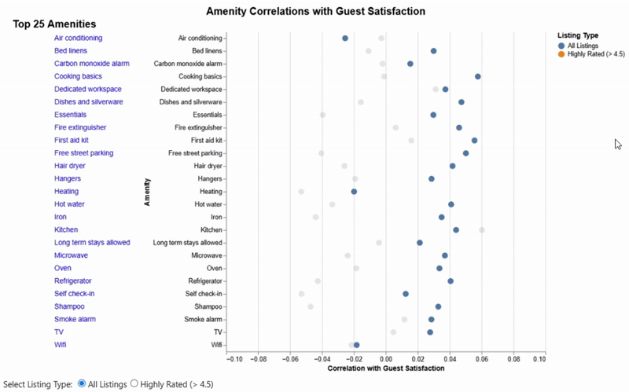

# Project Milestone 3
## Group AECA - Airbnb in NYC: Market Trends & Impact

### Erhan: Pricing & Affordability Trends

#### **1. How does room type impact price variations?**

**Design Goal:**  
This visualization was designed to explore how room types differ in pricing across New York and how these patterns vary by region. It aims to help users understand both the range and frequency of prices for each room type.

**Marks:**  
Box (Boxplot), Bar (Histogram), Point (Legend)

**Channels:**  
X-Position (Room Type), Y-Position (Price), Color Hue (Room Type), Opacity

**Characteristics of Channels that were exploited:**  
Position channels effectively encode categorical and quantitative variables—room types and prices, respectively. Color is used to distinguish room types, while opacity changes dynamically to draw focus to the selected type. The use of coordinated channels across the boxplot and histogram helps maintain cognitive continuity during interaction.

**Describe the interaction:**  
A price slider filters all views to focus on listings within a desired budget. A neighborhood dropdown allows users to isolate specific boroughs or compare all regions simultaneously. The custom interactive legend allows users to click a room type to highlight it while dimming the others. A linked histogram updates in real time based on room type selection and applied filters.

**Critique the view:**  
The visualization effectively combines summary statistics and full distributions through coordinated views. The interactive legend enhances user control and clarity. However, the legend may not be immediately perceived as clickable. Adding a default histogram view (when no room type is selected) or tooltip enhancements could further improve usability.

### **2. What is the effect of location (neighborhood group, latitude, and longitude) on price differences?**

**Design Goal:**  
This visualization was created to examine how Airbnb listing prices vary across NYC boroughs. It aims to help users identify regional pricing trends and make comparisons between neighborhoods through both spatial and statistical perspectives.

**Marks:**  
Circle (Map), Bar (Borough Chart)

**Channels:**  
Longitude/Latitude Position, Categorical X-Position, Color Hue, Size (Fixed)

**Characteristics of Channels that were exploited:**  
Color hue encoded price magnitude, allowing viewers to quickly identify higher and lower-priced areas. Geospatial positioning on the map reflected actual location, while x-position on the bar chart enabled categorical borough comparison. Color consistency across both views reinforced linking and aided interpretability.

**Describe the interaction:**  
When a borough is selected through clicking either the map or bar chart, it is highlighted across both views. Unselected areas are greyed out for context. A price slider further filters the listings displayed in both charts. This bi-directional interaction facilitates flexible, intuitive exploration from both geographic and quantitative entry points.

**Critique the view:**  
The map and bar chart function well together to support multi-angle comparison. The interactivity enhances usability and promotes deeper insight. However, listings in dense urban areas may visually overlap on the map, reducing clarity. Future iterations could incorporate aggregation techniques like hexbinning or spatial clustering to address this.

### **3. Does the host's listing count or years of hosting (host_since) influence listing prices?**

**Design Goal:**  
This visualization was designed to assess whether host experience and the number of listings a host manages influence Airbnb pricing. It supports exploration of how scale and tenure correlate with average price levels.

**Marks:**  
Rect

**Channels:**  
X-Position (Hosting Duration), Y-Position (Number of Listings), Color Hue

**Characteristics of Channels that were exploited:**  
Binned position channels were used to compare categories of host tenure and scale. Color hue encoded average price and highlighted pricing gradients across the 2D matrix. The combination of positional and color encoding enabled multi-dimensional comparisons in a compact format.

**Describe the interaction:**  
A price slider removes outliers, allowing a cleaner focus on typical pricing. A second slider restricts the number of listings to isolate small vs. large-scale hosts. A radio selection allows toggling between mean, median, or maximum pricing as the aggregation metric. These interactions provide analytical flexibility and support hypothesis-driven exploration.

**Critique the view:**  
The heatmap reveals general trends effectively and supports comparative analysis of host characteristics. The flexibility in aggregation is a strength. However, binning may obscure edge patterns or variability within each cell. Supplementing the heatmap with a scatterplot or tooltips could enhance interpretability.

### **4. How do reviews per month, review scores, and the total number of reviews correlate with pricing?**

**Design Goal:**  
This visualization was designed to explore whether review frequency and rating scores influence listing prices. It aims to uncover patterns that connect guest feedback metrics with pricing behavior on Airbnb.

**Marks:**  
Rect

**Channels:**  
X-Position (Reviews per Month), Y-Position (Review Scores), Color Hue

**Characteristics of Channels that were exploited:**  
Binning was used to group continuous variables into digestible segments. Color hue encoded average price and revealed pricing trends across review frequency and score combinations. Position channels helped distinguish the relationship between guest activity and listing valuation.

**Describe the interaction:**  
A price slider filters out expensive listings to focus on the general market. A review count slider removes low-signal listings. Users can pan and zoom along the reviews-per-month axis to inspect specific frequency ranges. Tooltips display exact values for detailed comparisons, supporting deeper investigation of each bin.

**Critique the view:**  
The heatmap effectively reveals how review behavior correlates with pricing. It’s especially strong in identifying sweet spots for high-rated, frequently-reviewed listings. However, some nuance is lost due to binning, and the view may underrepresent outliers or sparse bins. Supplementing with density plots or scatter overlays could address this limitation.

### **5. What role does availability over 365 days and minimum nights play in pricing strategies?**

**Design Goal:**  
This visualization was created to examine how pricing is influenced by listing availability and minimum night requirements, particularly across different room types. It aims to uncover distribution patterns that emerge under different booking constraints.

**Marks:**  
Area

**Channels:**  
Y-Position (Price), X-Offset / Column (Minimum Night Groups), Color Hue (Minimum Night Group)

**Characteristics of Channels that were exploited:**  
The area mark represents the density of prices within each minimum night group. Position encodes the distribution along the price axis, preserving variation and skew. Color distinguishes between minimum night categories, aiding comparison across bins. Faceting by room type introduces a third dimension, enabling segmented analysis.

**Describe the interaction:**  
A price slider filters out high-end listings to narrow the focus. A room type dropdown allows users to isolate specific room categories or view all simultaneously. Faceting separates room types into comparable columns, while x-offset organizes minimum night bins in a logical sequence.

**Critique the view:**  
The violin plots communicate pricing spread and shape effectively, particularly for identifying skew and variance. The layout supports comparison within and across room types. However, violin plots using `mark_area` may be unfamiliar to some viewers. Including median markers or frequency annotations could improve interpretability.

### Carol: Guest Experience & Satisfaction

#### **1. How do listing features like the number of amenities or instant booking availability impact guest satisfaction ratings?**

**Design Goal:**  
This visualization helps explore how different listing features, like the number of amenities or instant booking, relate to guest satisfaction. It lets users see overall trends and dive deeper into specific features to understand their impact on different rating levels.

**Marks:**  
Rectangles (Heatmap), Bars (Bar Chart)

**Channels:**  
X-Position (Feature), Y-Position (Rating Bin), Color Hue (Correlation Strength)

**Characteristics of Channels that were exploited:**  
Position is used to organize features and rating bins, making it easy to compare correlations across different categories. Colour encodes correlation strength using a red-blue scale, allowing users to quickly spot positive and negative relationships. Sorting the bars in descending order ensures the strongest correlations are immediately visible.

**Describe the interaction:**  
A dropdown menu lets users switch between different rating types (e.g., overall rating, cleanliness, value). Clicking on a feature in the heatmap highlights its correlation values in the bar chart, showing how the feature is associated with guest satisfaction across different rating bins.

**Critique the view:**  
The visualization effectively summarizes complex relationships in a compact and interactive format. The heatmap provides an overview of correlations, while the linked bar chart allows for a deeper exploration of specific features. However, since correlation does not imply causation, some relationships may be misleading. Adding tooltips or explanatory text could help users interpret the data more accurately.

#### **2. What is the relationship between guest satisfaction ratings and the price of listings for different room types?**

**Design Goal:**  
This visualization examines the relationship between listing prices and guest satisfaction ratings across different room types. It helps users identify trends, such as whether higher-rated listings tend to be more expensive, and provides a clearer picture of the price distribution.

**Marks:**  
Circles (Scatter Plot), Bars (Histogram)

**Channels:**  
X-Position (Rating Score), Y-Position (Price), Color Hue (Room Type), Height (Listing Count in Histogram), Opacity

**Characteristics of Channels that were exploited:**  
Position effectively maps guest ratings against price, allowing users to see trends in how price impacts satisfaction. Colour differentiates room types, while opacity highlights selected categories. In the histogram, bar height represents the number of listings at different price points.

**Describe the interaction:**  
A price range slider filters both charts, helping users focus on specific price points. The interactive legend allows users to highlight particular room types, dimming the others for better visibility. 

**Critique the view:**  
The visualization highlights how price and ratings are connected while offering flexibility through interactive filters. However, the scatter plot can become cluttered in certain price ranges, making patterns harder to distinguish. Adding density contours or a smoothing technique could help clarify overlapping points.

#### **3. Which amenities are most frequently associated with higher guest ratings in Airbnb listings?**

**Design Goal:**  
This visualization explores which amenities are most frequently linked to higher guest satisfaction in Airbnb listings. It allows users to compare correlations for all listings and highly-rated listings (ratings > 4.5) to see which amenities matter most.

**Marks:**  
Circles (Dot Plot), Text (Amenity List)

**Channels:**  
X-Position (Correlation Strength), Y-Position (Amenity), Color Hue (Listing Type), Opacity

**Characteristics of Channels that were exploited:**  
The position of each dot represents the correlation strength for each amenity. Colour differentiates between all listings and highly-rated listings, while opacity helps highlight selected amenities. The interactive text list also makes it easy to choose specific amenities.

**Describe the interaction:**  
A radio button lets users switch between all listings and highly-rated listings. Clicking an amenity in the list highlights its corresponding dot in the plot, and selecting a dot in the plot also highlights the corresponding text in the list, providing bidirectional linking. 

**Critique the view:**  
The visualization effectively highlights which amenities are associated with better guest ratings. However, since correlation does not imply causation, some amenities may appear important even if they don’t directly influence guest satisfaction. Additional analysis could help clarify whether these relationships are meaningful.

### Aaron: Location

#### **1. What role does instant-bookability serve as an incentive booster for less popular neighbourhoods?**

**Design Goal:**
This visualization is meant to compare the impacts of the instant bookability feature in AirBnBs in the most popular neighbourhood groups and corresponding neighbourhoods. The visualization accomplishes this by providing a heatmap with binary representation instant bookability against neighbourhood groups with a color hue encoding for number of reviews to reflect popularity.

**Marks:**
Rect, Bar

**Channels:**
Color, Y-position, X-positioning, Color Hue

**Characteristics of Channels that were exploited:**
The color represented Neighbourhood groups, while the gradient hue for the heatmap represented the continuous number of reviews. Y positioning was used to reflect the number of reviews per top 10 neighbourhood per neighbourhood group. While both X and Y positioning were used to reflect distinct interactions between number of reviews and instant bookability status on the heatmap.

**Describe the interaction:**
When a binned number of reviews is selected, all categories of that bin will be highlighted in the heatmap. Additionally, depending on the dropdown neighbourhood selected, the heatmap and bar chart will be filtered to reflect neighbourhoods according to that neighbourhood. The highlighted categories of a particular binned number of reviews promotes comparability and distinction between groups and their number of reviews.

**Critique the view:**
The heatmap and bar chart effectively communicate the intricacies on a higher and lower level for the number of reviews per neighbourhood group and its corresponding neighbourhoods. The added use of the heatmap y axis categories help define clear distinctions and impact of an AirBnB's instant bookability rate. However, outliers in number of reviews may skew color gradients leading to a inbalance of color hues, decreasing ability of effective comparisons.

#### **2. Is there a difference in host behavior (host identity verified, calculated host listings count) by location?**

**Design Goal:**
This visualization is supposed to give an interactive experience to observe top neighbourhood host information through tooltips and highlights on the New York landscape. This visualization accomplishes this by giving users a direct way to investigate popular neighbourhoods by the bar chart on the right, clicking on neighbourhood groups and being able to investigate data points and host tooltips on the geomap to the left.

**Marks:**
Bar, circle

**Channels:**
Color, Y-position, X-positioning

Characteristics of Channels that were exploited:
The color represented Neighbourhood groups, reflecting by the blue hue on each concatenated visualization. XY positioning on the geomap was used to reflect longitude and latitude, while Y positioning was used on the bar chart to reflect the Total number of review. 

**Describe the interaction:**
There is a bidirectional interaction that highlights all bins or circles on either graph, representing the neighbourhood group associated with either value. The goal of this interaction is to allow the viewer to trace from popular neighbourhoods and quickly observe and be highlighted information pertaining to that group on the map where additional information can be found through tooltip interactions.

**Critique the view:**
The geomap and bar chart do a great job providing a high level overview. In addition, the linkage through interaction and proximity allows for thorough exploration and comparison. However, the geomap's tooltips as a means of juxtaposing host behavior is too focused and specific to points. As a result, the high density of points on certain parts of the map make conclusions and observations very hard to develop.

#### **3. Is it 'easier' to be a superhost compared to typical hosts in terms of host behavior and pricing in certain locations?**

**Marks:**
Rect

**Channels:**
Y-position, X-position, Color Hue

**Characteristics of Channels that were exploited:**
The color hue for the heatmap represented the continuous number of superhosts in each neighbourhood group's neighbourhoods. X positioning was used to reflect the categorical neighbourhoods of each faceted neighbourhood group, while Y positioning expressed the binary host characteristics of whether they were verified or had a profile picture.

**Describe the interaction:**
The interaction actively filters by neighbourhood group for more effective comparisons and juxtaposition between the two host characteristics, profile picture presence and identity verification

**Critique the view:**
The faceted juxtaposed heatmaps allow for clear comparisons between neighbourhood groups when it comes to different factors of host_identity_verification and host_has_profile_pic. In addition, the added dropdown filter for neighbourhoods allow for even clearer analysis and comparisons. However, the lengthy faceted graphs may allow for too much visual clutter and ineffective comparison in part due to the missing data in that is not colored. Perhaps placing neighbourhood groups with different y-axis features side by side would be more effective. Moreover, the color gradient reflects a continuous numerical feature, which may not allow for exact comparisons.

### Ayuho: Host Behaviour & Market Competitiveness

#### **1. How does host identity verification influence the success of a listing (in terms of reviews and ratings)?**

**Design Goal:**

This visualization explores whether verified hosts (host_identity_verified=True) achieve greater success than non-verified hosts (False), as measured by guest ratings and the number of reviews. It allows users to examine if verification status is linked to higher guest feedback and ratings, and whether these patterns change when focusing on specific rating ranges.

**Marks:**

Lines and points (Box Plots), Area (Violin Density Plots)

**Channels:**

X-Position (Verification Status), Y-Position (Guest Ratings, Number of Reviews), Colour Hue (Verification Status), Opacity (Highlights data within selected rating ranges)

**Characteristics of Channels that were exploited:**

Position effectively compares guest ratings and review counts across verification status categories. Colour differentiates verified and non-verified hosts, which helps to quickly identify differences. Box plots clearly highlight quartiles and outliers, while violin plots display detailed distribution shapes.

**Describe the interaction:**

Two sliders (Min Guest Rating & Max Guest Rating) filter the bottom two plots (number of reviews) by guest rating, enabling users to explore specific subsets of listings. The top two plots (ratings distributions) remain static.

**Critique the view:**

The visualization effectively demonstrates differences between verified and non-verified hosts by combining box and violin plots to present both summary statistics and detailed distributions. Interactive filters increase flexibility by allowing users to focus on specific guest rating ranges for review counts, although only the review plots respond to the sliders. Clarifying that the rating plots remain static could further improve usability. Overall, the design successfully communicates key differences in guest ratings and review counts.

#### **2. How do host responses (e.g. response time, acceptance rate) differ between superhosts and non-superhosts, and how does this impact listing success?**

**Design Goal:**

This visualization investigates the differences in response behaviours between superhosts and non-superhosts, focusing on response time and acceptance rate. It also examines whether these behaviours influence listing success, as indicated by guest ratings.

**Marks:**

Bars (Normalized Stacked Bar Chart), Lines and Points (Box Plot)

**Channels:**

X-Position (Response Time Categories, Superhost Status), Y-Position (Proportion, Acceptance Rate), Colour Hue (Superhost Status), Opacity

**Characteristics of Channels that were exploited:**

Position shows differences in response behaviours and acceptance rates between superhosts and non-superhosts. Colour helps to distinguish between the two groups, while opacity highlights selected categories when filtered.

**Describe the interaction:**

Two guest rating sliders allow users to filter listings within a chosen rating range. The dropdown menu filters by response time category, affecting both the normalized stacked bar chart and the box plot. This interaction helps users analyze whether quick responses and high acceptance rates are linked to higher guest ratings.

**Critique the view:**

The visualization effectively follows the principles of expressiveness and effectiveness. Ordered data (response times and acceptance rates) is clearly represented on the vertical axes, while categorical data (superhost status) is shown on the horizontal axes with distinct colours. The interactive elements (sliders and dropdown) make it easy to explore how response behaviours and acceptance rates vary across different guest rating ranges. However, since the sliders only affect the bar chart, it may cause confusion. Adding a label to specify which chart the sliders influence would improve usability.

#### **3. How do hosts with multiple listings strategically set their pricing, and how does this impact guest satisfaction?**

**Design Goal:**

This visualization explores how hosts with different numbers of listings set their prices and how this affects guest satisfaction ratings. It helps users see if smaller hosts set higher prices and achieve better ratings compared to large hosts, who might use lower prices to attract more bookings. Users can filter by guest ratings using sliders and highlight specific host groups using the interactive legend.

**Marks:**

Bars (Bar chart), Areas (Density plot)

**Channels:**

X-Position (Number of Listings, Guest Ratings), Y-Position (Average Price, Density), Colour Hue (Listing Count Category), Opacity

**Characteristics of Channels that were exploited:**

Position clearly shows the relationship between average price, guest ratings, and host size. Colour effectively separates host categories, and opacity helps highlight selected categories for easier comparison.

**Describe the interaction:**

Two sliders let users choose guest rating ranges, filtering the bar chart. The interactive legend allows users to highlight specific host categories on both charts at once, creating an easy comparison.

**Critique the view:**

This visualization clearly follows the expressiveness and effectiveness principles. Position and colour effectively show important information, such as how average price changes with guest ratings and host size. The interactive sliders help users explore data based on guest ratings, while the bidirectional legend selection makes comparing different host categories easy. However, it might be unclear that the sliders only affect the bar chart, not the density plot, so adding a label could help. 